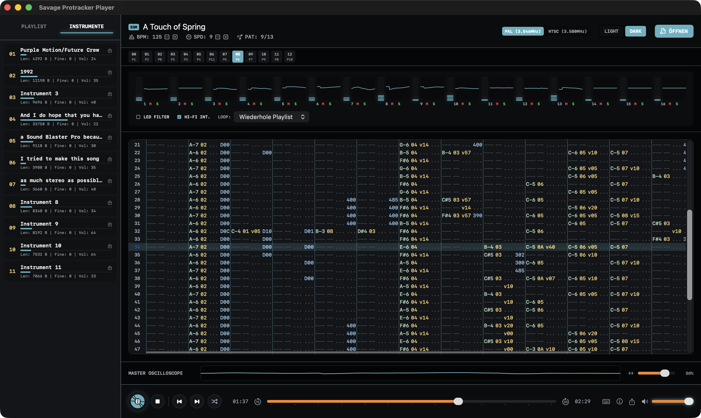

<p align="center">
  
</p>

<h1 align="center">Savage Mod Player</h1>

**🌐 Sprache / Language:** [English](README.md) · [Deutsch](README.de.md)

<p align="center">
  <strong>Nativer macOS-Tracker-Player für MOD, S3M, XM und IT — mit unabhängiger Swift-Replay-Engine.</strong>
</p>

Ein eigenständiger Tracker-Modul-Player mit der nativen macOS-App im Mittelpunkt:

1. **Native macOS App (`Savage Mod Player.app`)** — SwiftUI-Desktop-Anwendung mit `AVAudioEngine`, `AVAudioSourceNode`, echten Echtzeit-Oszilloskopen und Pegel-Metern. Sie spielt ProTracker- und Multichannel-MODs (6/8/… Kanäle, u. a. `6CHN`/`8CHN`/`FLT8`), 15-Sample-Soundtracker-Module, **ScreamTracker 3 (`.s3m`)**, **FastTracker II (`.xm`)** und **Impulse Tracker (`.it`)** — und bringt ein **Quick-Look-Plugin** mit: Leertaste auf einer `.mod`/`.s3m`/`.xm`/`.it` im Finder öffnet eine abspielbare Audio-Vorschau.
2. **HTML5-Bonusplayer (`savage-mod-player.html`)** — Eine winzige einzelne HTML-Datei (unter 60 KB), die ohne Webserver direkt per Doppelklick aus dem Dateisystem funktioniert. Sie konzentriert sich bewusst auf klassische 4-Kanal-ProTracker-MODs.

**Kein libopenmpt-Wrapper:** Die native App parst, sequenziert, synthetisiert und mischt MOD/S3M/XM/IT selbst in Swift. Sie bindet weder `libopenmpt`, `libxmp`, `libmodplug`, DUMB noch eine andere Modul-Replay-Library ein. `openmpt123` dient ausschließlich als optionale externe Referenz bei Entwicklung und Tests.

Beide Varianten enthalten standardmäßig keine Moduldateien. Musikstücke werden per Drag & Drop oder Datei-Dialog geladen.

<p align="center">
  
</p>

---

## Download

Fertige Builds der macOS-App stehen als notarisierte DMGs auf der [Releases-Seite](https://github.com/DanielMuellerIR/savage_modplayer/releases) bereit. DMG herunterladen, öffnen und die App in den Programme-Ordner ziehen.

Der HTML5-Player benötigt keinen Download über die Releases hinaus: Die Datei `savage-mod-player.html` lässt sich direkt im Browser öffnen.

---

## Quick-Look-Plugin installieren

Das Quick-Look-Plugin steckt bereits im App-Bundle (`Contents/PlugIns/`) — es gibt nichts separat zu installieren:

1. App aus dem DMG nach **`/Applications`** ziehen.
2. Die App **einmal starten** (dabei registriert macOS die enthaltene Quick-Look-Extension).
3. Im Finder eine `.mod`-, `.s3m`-, `.xm`- oder `.it`-Datei markieren und die **Leertaste** drücken — die Vorschau zeigt den macOS-Audio-Player mit Play, Scrubbing und Lautstärke. Sie rendert bis zu den ersten 60 Sekunden und cached diese Vorschau für unveränderte Dateien; weitere Aufrufe sind dadurch sofort da. Nicht unterstützte Dateien zeigen den Parsergrund statt eines endlosen Ladeindikators.

Falls keine Vorschau erscheint:

- Quick-Look-Dienst neu laden: `qlmanage -r` im Terminal, dann die Vorschau erneut öffnen.
- Registrierung prüfen: `pluginkit -m -p com.apple.quicklook.preview | grep -i savage` muss einen Eintrag zeigen; falls nicht, App einmal starten oder neu nach `/Applications` kopieren.
- **Hinweis zu `.mod` und VLC**: Ist VLC (oder eine andere App, die `.mod` als Audio-/Video-Typ registriert) installiert, kann macOS `.mod`-Dateien mit seiner eingebauten Medien-Vorschau abfangen, bevor Drittanbieter-Plugins gefragt werden — eine Systembeschränkung von Quick Look. Die Extension claimt zusätzlich die verifizierten VLC-Identifier für `.s3m`, `.xm` und `.it`.

---

## Funktionsumfang

- **Unabhängige native Replay-Engine**: projekteigene Swift-Parser, Sequencer, Instrument-/Voice-Engines, Effekte, Filter, Resampling und Mixer. Hinter der Oberfläche steckt kein fremder Modul-Decoder.
- **Formatvielfalt (macOS-App)**: ProTracker-MOD, Multichannel-MOD (`xCHN`/`xxCH`/`CD81`/`OKTA`/`FLT8`), 15-Sample-Soundtracker, ScreamTracker 3 (`.s3m`), FastTracker II (`.xm`) und Impulse-Tracker-Dateien bis `cmwt=0x0216` (`.it`) im Sample- oder Instrument-Modus. IT unterstützt 64 Pattern-Kanäle, einen vorallozierten 256-Voice-NNA-Pool, komprimierte 8-/16-Bit-Mono-/Stereo-Samples, Hüllkurven, Filter, Effekte und Sustain-Loops. Der HTML5-Player bleibt bewusst kompakt und spielt 4-Kanal-MODs.
- **Quick-Look-Vorschau (macOS-App)**: Das mitgelieferte Quick-Look-Plugin rendert und cached bis zu den ersten 60 Sekunden von `.mod`/`.s3m`/`.xm`/`.it` mit der Player-Engine und zeigt im Finder (Leertaste) den nativen Audio-Player mit Play und Scrubbing. Nicht unterstützte Dateien zeigen einen lesbaren Grund.
- **Drag & Drop**: Einzelne `.mod`-/`.s3m`-/`.xm`-/`.it`-Dateien, ganze Ordner (rekursiv) oder Zip-/7-Zip-Archive können auf den Player gezogen werden.
- **Automatische Playlist**: Ein konfigurierbarer Autoplay-Ordner (macOS-App: Einstellungen, Cmd+,) wird beim Start gescannt und als Playlist geladen; ohne Konfiguration wird ein `audio/`-Unterordner neben dem Player bzw. der App verwendet.
- **Hierarchische Playlist**: Ordner und Archive erscheinen als auf- und zuklappbarer Baum. Ordner starten zugeklappt, der Pfad zum laufenden Titel klappt automatisch auf, und Wiedergabe wie Shuffle laufen über alle Ordner hinweg.
- **Archive wie Ordner (macOS-App)**: Zip- und 7-Zip-Archive werden unsichtbar in ein temporäres Verzeichnis entpackt (aufgeräumt beim Beenden) und in der Playlist wie normale Ordner angezeigt.
- **Playlist-Bedienung**: Einzelklick auf einen Playlist-Eintrag lädt und startet den Titel direkt. Nach dem Songende kann die Playlist automatisch weiterlaufen.
- **Echtzeit-Oszilloskope**:
  - Ein echtes Stereo-Master-Mischungs-Oszilloskop direkt aus dem Audio-Renderpfad.
  - Separate Spur-Oszilloskope für jeden Kanal (dynamische Kanalzahl), die die tatsächlichen Schwingungsformen direkt aus dem Synthesizer-Render-Block visualisieren.
- **Multi-Theme**:
  - **Dark**: Graphit-/Schwarzpalette mit gutem Kontrast und gedämpften Akzentfarben.
  - **Light**: klassischer, heller macOS-naher Stil mit nüchternem Kontrast.
- **PAL- & NTSC-Taktfrequenzen**: Umschaltbare Paula-Taktung (3,546 MHz PAL vs. 3,580 MHz NTSC) für Paula-basierte MOD-Formate; bei Formaten mit eigenem Frequenzmodell ist die Steuerung ausgeblendet.
- **Lautstärke & Stereo-Separation**: Psychoakustische (quadratische) Lautstärkeskalierung und einstellbare Stereo-Separation (Bleed von 0% Mono bis 100% Hard-Panning).
- **Hi-Fi Resampling**: Umschaltbares linear-interpoliertes Sample-Playback für weicheren Sound (deaktivierbar für originalen 8-Bit-Crunch).
- **WAV- & Stem-Export**: Export des gesamten Songs in eine Stereo-WAV-Datei sowie Export einzelner Instrumentensamples als WAV.
- **Komplette Tastatursteuerung**: Leertaste für Play/Pause, Pfeiltasten links/rechts für Song-Positionen, Pfeiltasten oben/unten für Song-Wechsel in der Playlist.

---

## Bedienelemente & Anzeigen erklärt

Die Transport-Tasten erklären sich von selbst, doch die tracker-typischen Anzeigen und Schalter tragen ein Stück Amiga-Geschichte in sich. Jeder Punkt hier ist in der App auch als **Tooltip** hinterlegt — einfach mit dem Mauszeiger auf einem Bedienelement verweilen, bis die Erklärung erscheint. Weil Tooltips ein paar Sekunden brauchen und leicht zu übersehen sind, sind sie hier zusätzlich gesammelt.

**Kopfzeilen-Anzeigen**

- **CH** (genutzte Kanäle): zählt Pattern-Kanäle, die tatsächlich Noten, Instrumente, Lautstärkeangaben oder Effekte enthalten; reservierte, leere Kanäle zählen nicht mit. Tracker-Grid und Kanal-Oszilloskope zeigen genau diese Kanäle unter ihrer ursprünglichen Kanalnummer, sodass weder ITs reservierte 64-Kanal-Kapazität noch Lücken leere Spalten oder eine unnötige Scrollbar erzeugen.
- **BPM** (Beats per Minute): Wiedergabe-Tempo. Der Amiga-Standard ist 125. Mit −/+ veränderbar; ein Song kann sein Tempo per Effekt auch selbst umstellen. Bei Songwechsel wird der Header-Wert des neuen Moduls gesetzt.
- **SPD** (Speed): Ticks pro Pattern-Zeile (Amiga-Standard 6). Kleiner = die Zeilen laufen schneller durch, größer = langsamer. Zusammen mit BPM ergibt das die effektive Geschwindigkeit.
- **PAT** (Pattern-Position): aktuelles Pattern und Gesamtzahl in der Abspielreihenfolge des Songs. Ein Pattern ist ein Notenblock (meist 64 Zeilen); der Song spielt sie in dieser Reihenfolge ab.

**Taktfrequenz** (neben dem Master-Oszilloskop, nur bei Paula-basierten MOD-Formaten)

- **PAL** (3,546 MHz Paula-Takt): wie bei europäischen Amigas — die Referenz-Tonhöhe und -Geschwindigkeit der meisten Module.
- **NTSC** (3,580 MHz Paula-Takt): wie bei US-Amigas — Module klingen minimal höher und laufen etwas schneller als mit PAL.

**Klang-Optionen**

- **LED-Filter**: der zuschaltbare Amiga-Tiefpass bei ~3,2 kHz, der die Höhen kappt — der dumpfere Originalklang, wie wenn am echten Amiga die Power-LED leuchtete.
- **Hi-Fi-Interpolation**: glättet die Samples beim Resampling (weicherer Klang). Ausgeschaltet klingt es wie die Original-Hardware — roher 8-Bit-Sound mit hörbarem Aliasing.
- **Stereo-Separation**: 100 % = hartes Amiga-Panning (Kanäle ganz links/rechts), 0 % = Mono. Dazwischen wird Übersprechen beigemischt, das Kopfhörer-Ermüdung vermeidet. Am deutlichsten mit Kopfhörern hörbar; über Laptop-Lautsprecher kaum.
- **Loop-Modus**: was nach dem Songende passiert — Playlist fortsetzen, den Song wiederholen oder stoppen.

**Transport & Navigation**

- **Shuffle** (Zufallswiedergabe): eingeschaltet springen Titelwechsel und Songende zufällig durch die Playlist; ausgeschaltet spielt die Playlist der Reihe nach.
- **−15 s / +30 s**: zurück-/vorspringen (zeilengenau; bei Tempo-Wechseln näherungsweise).
- **Positions-Schieberegler**: eine Stelle im Song wählen — funktioniert auch bei gestoppter Wiedergabe: Play startet dann ab dieser Stelle.

---

## Technischer Hintergrund

### Synthese & Paula-Emulation

Die Audio-Engine simuliert das Amiga Paula-Hardwareverhalten:
- **Taktung**: Der Taktgeber rechnet mit der PAL-Paula-Frequenz von `3.546.894,6 Hz`. Der Pitch-Faktor ergibt sich aus dem Frequenzverhältnis zur aktuellen Audio-Ausgaberate.
- **Stereo-Panning**: Amiga-typisches Hardware-Panning (Kanäle 1 und 4 links, Kanäle 2 und 3 rechts) mit einstellbarer Software-Mischung zur Vermeidung von Kopfhörer-Ermüdung.
- **Effekte**: Vollständige Wiedergabetreue für alle Standard-ProTracker-Befehle, einschließlich Arpeggio (`0x0`), Slides (`0x1`/`0x2`), Tone Portamento (`0x3`), Vibrato (`0x4`), Volume Slides (`0xA`), Position Jump (`0xB`), Volume Set (`0xC`), Pattern Break (`0xD`), Extended Effects (`0xE` wie Loop, Cut, Note Delay, Retrigger) und Tempo-Steuerung (`0xF`).

Für ScreamTracker 3 rechnet die Engine im ST3-Periodenmodell (C2Spd-basierte Perioden gegen die ST3-Clock 14,3 MHz) statt in Amiga-Paula-Perioden; die ProTracker-Effekte werden um S3M-Spezifika (Fine-/Extra-Fine-Slides mit Effekt-Memory, Tremor, Fine-Vibrato, Global Volume) ergänzt.

Für FastTracker II fährt die Engine ein eigenes Instrument-Voice-Modell: lineare Frequenztabelle (exponentielle Frequenz aus linearen Perioden), Multi-Sample-Instrumente mit Keymaps, Lautstärke- und Panning-Hüllkurven (Sustain und Loop, pro Tick interpoliert), Key-Off mit Volume-Fadeout, Auto-Vibrato mit Sweep und Ping-Pong-Sample-Loops. Der XM-Effektsatz inklusive Volume-Column und Per-Kanal-Effekt-Memory wird auf den gemeinsamen DSP-Kern übersetzt.

Für Impulse Tracker trennt die Engine 64 logische Pattern-Kanäle von einem vorallozierten Pool mit 256 Wiedergabe-Voices. Implementiert sind Sample- und Instrument-Modus, NNA/DCT/DCA, 120er Sample-Maps, IT-2.14-/2.15-Kompression, Stereo- und Sustain-Loops, Pitch-/Pan-/Filter-Hüllkurven, resonante Filter pro Voice, Sample-Vibrato, Surround, IT-Effekt-Memory sowie die Profile `Old Effects` und `Compatible Gxx`. Von OpenMPT erzeugte IT-Dateien verwenden zusätzlich strukturiertes XTPM-/STPM-Parsing, klassische/alternative/moderne Tempoformeln, gespeicherte Preamp-/Mix-Werte, Restart-Position, erweiterten Filterbereich und die jeweils zutreffenden PCM-`PlayBehaviour`-Flags.

Kompatibilitätsmeldungen entstehen aus einer Capability-Analyse. `cwtv` identifiziert den erstellenden Tracker, `cmwt` steuert dagegen die erforderliche IT-Semantik; eine neuere OpenMPT-Erstellerversion ist allein kein Warnungsgrund. Metadaten, inaktive MIDI-Flags, unbenutzte Plugin-Definitionen und markerähnliche Bytes im PCM bleiben still. Eine Warnung erscheint nur, wenn ein Pattern der abgespielten Order-Liste tatsächlich ein nicht unterstütztes klangrelevantes Merkmal erreicht, soweit möglich mit Instrument, Kanal, Plugin-Slot oder Chunk-ID. `savage-cli --info` zeigt die vollständige strukturierte Diagnose.

### Bekannte Impulse-Tracker-Einschränkungen

- IT-Strukturen bis `cmwt=0x0216` und bekannte PCM-relevante OpenMPT-IT-Erweiterungen werden unterstützt. MPTM wird sicher erkannt, bleibt aber ein separates nicht unterstütztes Format.
- Der Player ist bewusst kein VST-/AudioUnit-Host und gibt kein externes MIDI aus. Eingebettete MIDI-Makros sind auf gebräuchliche Cutoff-/Resonance-Filtermakros beschränkt. Diese Pfade warnen nur, wenn sie tatsächlich getriggert werden.
- Veraltete OpenMPT-Bugemulationen für Swing vor 1.17, die abgelöste alte Pattern-Loop-/Jump-Regel, ungenauen historischen Ping-Pong-Überschuss und proprietäre Envelope-Release-Knoten werden nicht emuliert. Nur die tatsächliche Nutzung erzeugt eine merkmalsspezifische Warnung.
- Erweiterte IT-Patterns mit 1 bis 1.024 Zeilen und bis zu 240 Patterns werden akzeptiert. Gelöschte Pattern-Referenzen in der Order-Liste werden wie in OpenMPT übersprungen.

### Architektur

| Schicht | macOS (Swift) | HTML5-Bonusplayer |
|---|---|---|
| Parser | `ModuleLoader` plus projekteigene MOD-/S3M-/XM-/IT-Parser (`SavageModPlayerCore`) | `modplayer.js` |
| DSP / Mixer | Projekteigener Sequencer und DSP via `AVAudioSourceNode`, bis 64 logische Kanäle / 256 IT-Voices | `mod-player-worklet.js` (AudioWorklet) |
| UI | SwiftUI + Canvas | Vanilla JS + CSS Grid |
| Quick Look | `quicklook/PreviewProvider.swift` (Appex, WAV-Offline-Render) | — |

---

## Build

### macOS App

```bash
bash build_app.sh                 # → "Savage Mod Player.app" (inkl. Quick-Look-Appex)
```

`build_app.sh` kompiliert neben der App auch die Quick-Look-Extension
(`quicklook/`) und legt sie im App-Bundle unter `Contents/PlugIns/` ab.

Die App befüllt die Playlist beim Start aus dem Autoplay-Ordner, der im Einstellungs-Fenster (Cmd+,) konfiguriert ist. Ist keiner gesetzt, sucht sie nach einem `audio/`-Verzeichnis neben der Anwendung und lädt dort gefundene `.mod`-/`.s3m`-/`.xm`-/`.it`-Dateien (oder `mod.*`-Dateien) automatisch in die Playlist. Diese Dateien sind nur lokale Testdaten und gehören nicht ins Git-Repository.

Für Release-Builds signiert `build_app.sh` automatisch mit der Developer-ID
`Developer ID Application: Daniel Mueller (9QSWKSR4NQ)`, sofern sie im
Schlüsselbund verfügbar ist. Lokale unsignierte Builds sind mit
`SIGN_APP=0 bash build_app.sh` möglich.

### Kommandozeile (`savage-cli`)

Ein kopfloser Renderer, der exakt dieselbe DSP-Engine nutzt wie App und Quick
Look — gedacht für A/B-Vergleiche gegen Referenz-Renderer und für skriptbare
Prüfungen ohne GUI.

```bash
swift build                                  # → .build/debug/savage-cli
savage-cli song.it --info                    # strukturierte Moduldiagnose, kein Render
savage-cli song.mod -o out.wav -s 30         # 30 s als WAV rendern
savage-cli song.mod --play                   # Echtzeit-Wiedergabe (CoreAudio / ALSA)
savage-cli song.mod --stdout | aplay -f S16_LE -c2 -r44100   # rohes PCM in einen Player
savage-cli --list audio/                     # spielbare Module eines Ordners auflisten
```

`--stdout` schreibt rohes 16-Bit-Stereo-PCM (Little Endian) nach stdout, während
Statusmeldungen auf stderr bleiben — der Strom lässt sich also direkt in einen
Player pipen. `--list` gibt einen Pfad je Zeile aus und endet mit Exit-Code 1,
wenn nichts Spielbares gefunden wurde. `--normalize` hebt den Pegel wie Quick
Look an; für rohe Vergleiche weglassen.

#### Linux

Die Core-Bibliothek und `savage-cli` bauen und laufen unter Linux; die SwiftUI-App
und die Quick-Look-Extension sind macOS-only und werden dort aus dem Paket
ausgeblendet.

```bash
docker run --rm -v "$PWD":/src -w /src swift:6.0 \
  bash -c "apt-get update -qq && apt-get install -y -qq libarchive-tools && swift build && swift test"
```

`libarchive-tools` liefert `bsdtar`, mit dem der Playlist-Scanner `.zip`/`.7z`
liest. Ohne das Paket werden Archive ignoriert und zwei Tests übersprungen; alles
Übrige funktioniert.

`--play` nutzt die Audio-Ausgabe der Plattform — AVAudioEngine auf macOS, ALSA
unter Linux (braucht `libasound2-dev` zum Bauen). Der Wiedergabepfad liefert
sample-identisch dasselbe wie der Offline-Renderer; beide holen aus derselben
Engine.

Der Render ist je Plattform deterministisch, aber **nicht** bitgleich *zwischen*
den Plattformen: `tanh` im Limiter rundet in glibc und Darwin-libm
unterschiedlich, wodurch rund 0,01 % der Samples um ein einzelnes LSB abweichen —
etwa 115 dB unter dem Signal und damit weit unter der Hörschwelle.
Tastatursteuerung und Playlist-Wiedergabe fehlen noch.

### HTML5-Bonusplayer

```bash
python3 build.py                  # → savage-mod-player.html (unter 60 KB)
python3 build.py --no-min         # ohne Minifizierung
```

Die erzeugte Single-File-Variante `savage-mod-player.html` ist Teil des
Repositories, damit der kompakte Player auch ohne lokalen Build direkt genutzt
werden kann.

### DMG (für Releases)

```bash
bash build_dmg.sh                 # → build/Savage Mod Player.dmg
bash build_dmg.sh --notarize      # DMG signieren, notarisieren und stapeln
```

Das DMG enthält ein Retina-kompatibles Hintergrundbild (1x/2x TIFF via `tiffutil`).
Für die Notarisierung wird ein Keychain-Profil erwartet, standardmäßig
`SavageModPlayerNotary`. Es kann einmalig interaktiv angelegt werden:

```bash
xcrun notarytool store-credentials SavageModPlayerNotary
```

### Tests

```bash
swift test
swift test --filter MultiFormatTests
node Tests/js/worklet-timing.mjs
python3 tools/reference_compare.py --output-dir /tmp/savage-it-reference audio/example.it
```

Die Suite deckt Parser (alle MOD-Varianten, S3M, XM, IT, synthetische und echte Dateien),
DSP-Timing, Sequenzierung, den Offline-WAV-Renderer des Quick-Look-Plugins und
die Parität zwischen Swift- und Browser-DSP ab. Das optionale Referenz-Harness
vergleicht den nativen Renderer mit dem festgeschriebenen `openmpt123`-Build und
meldet Dauer, Signalpegel, Hüllkurvenkorrelation, Lag, Onset-Zuordnung und
spektrale Ähnlichkeit, ohne libopenmpt als Produktions-Backend zu verwenden.

---

## GitHub-Veröffentlichung

```bash
bash publish_github.sh --dry-run --release
bash publish_github.sh --release
```

Das Veröffentlichungsskript setzt `origin` auf
`https://github.com/DanielMuellerIR/savage_modplayer.git`, blockt
versehentlich getrackte Audio- und Release-Artefakte und erzeugt bei
`--release` den passenden GitHub-Release-Eintrag mit DMG-Asset.

## Herkunft

Die ProTracker-Engine entstand zuerst im Schwesterprojekt
[FraktalLab](https://github.com/DanielMuellerIR/FraktalLab) als eigene
TypeScript-/AudioWorklet-Implementierung (`AmiModPanel` / `utils/modplayer`,
kein `libopenmpt`). Für dieses Projekt wurde sie als native Swift-Engine mit
`AVAudioSourceNode` portiert und anschließend um projekteigene S3M-, XM- und
IT-Parser, Sequenzierung, Effekte und Voice-Verwaltung erweitert. Die ursprüngliche
Web-Implementierung bleibt als kompakter Single-File-Bonusplayer erhalten.
Mitgelieferte Moduldateien sind nicht Teil dieses Repositories.

## Lizenz

**WTFPL** (Do What The Fuck You Want To Public License) — siehe [LICENSE](LICENSE).
